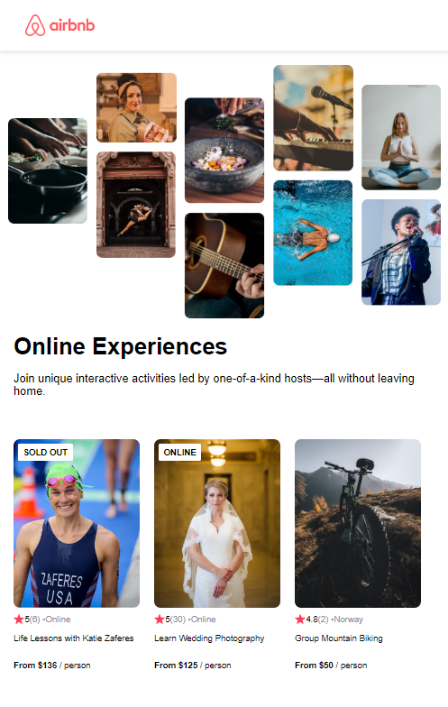
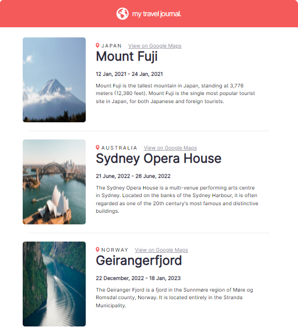
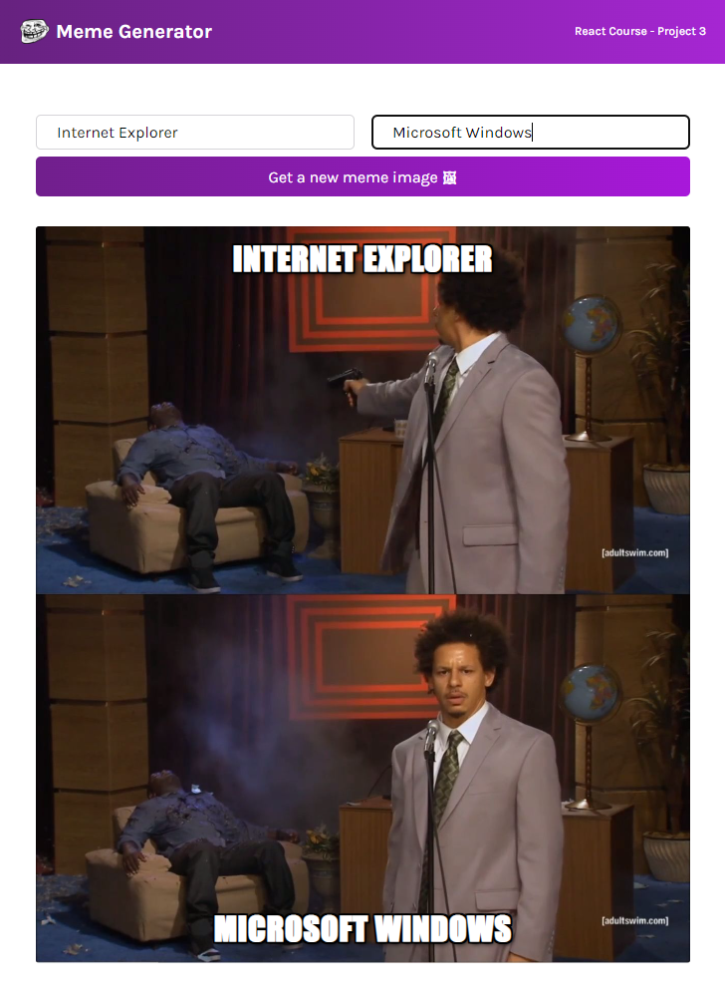
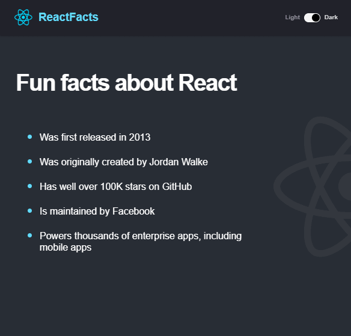
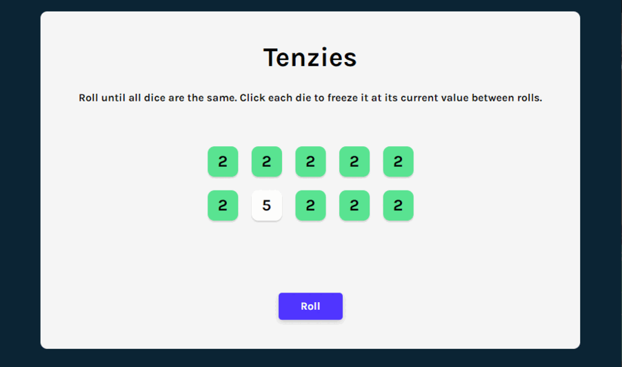

# React-Intro
```
Learning React from stratch with Scrimba
Focusing on functional components
```
<h2>Solo Projects of Scrimba React tutorial</h2>

## Project 1: A static website with React JSX Components
<div align-items="center">
   
</div>

## Project 2: Static website with React props 
* Airbnb website


* Travel website


## Project 3: Interactive web app with React State and useEffect
A web app allowing user to create a meme with fetching a meme image api
<br/>


## Project 4: Adding Features Project
These projects are purposely practicing to be familiar with the provided code base. Adding new feature and implementation to the existed system

<h3>Light-Dark Theme</h3>
 Implementing toggle functionality to allow toggle light and dark theme


## Tenzies Game
A Tenzies game from stratch summarizing everything I have learned


